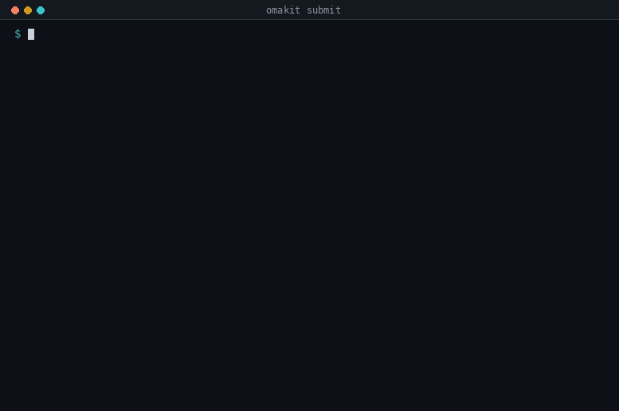
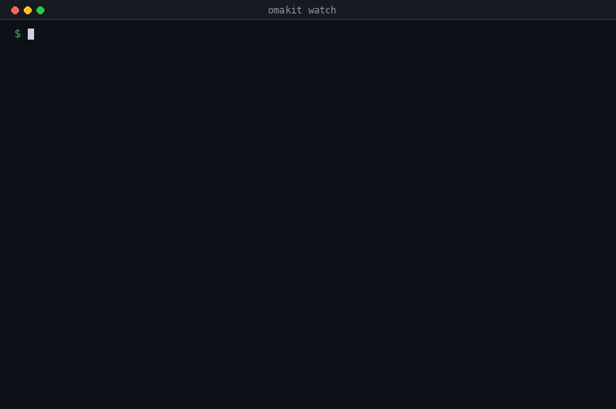
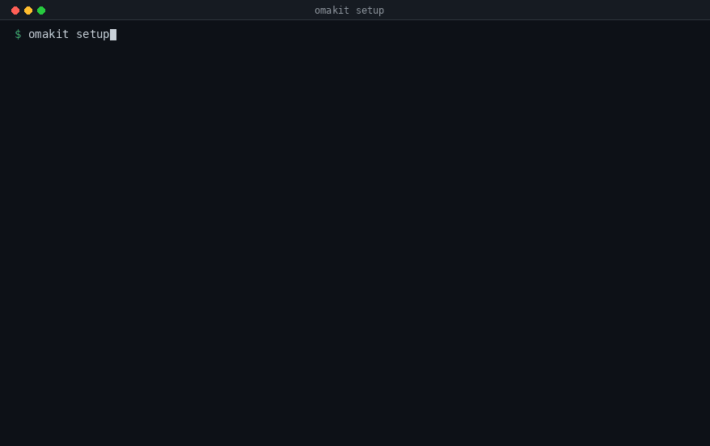

<p align="center">
  
</p>

**Everything knowable about an Omarchy Quattro plugin submission, checked
before you post it:** the tree, the manifest, the form, the commit, and the
marketplace's own security baseline with its outcome reported as it is. A
submission is judged at one exact commit and drifts from it the moment you
push; `watch` says when that has happened. All of it runs on your own machine
and publishes nothing: no issue, no comment, no label, nobody's attention spent
until you choose to.



The plugin above is refused for three things the marketplace itself refuses,
and warned about a fourth: it ships instruction files an agent will read once
installed. **103 marketplace issues mention exactly that, and no automated check
reports it, so today an author finds out from a human review round.** It is a
warning and not a refusal, because the marketplace does list plugins that ship
them: 6 of 34 inspected do, at the commit that was listed.

```bash
omakit submit <plugin-repo> --category Widgets --tags bar,quickshell
```

Fifteen checks, each naming its source and, when it fails, the measured reason it
exists. A blocking failure produces no submission body at all, because a refusal
that still hands you the body is only a suggestion.

## Why it exists

Four numbers, all measured on public marketplace data on 2026-09-12. Method,
limits and the rest of the figures: [docs/MEASUREMENTS.md](docs/MEASUREMENTS.md).

| Measured | Consequence |
| --- | --- |
| 39 submissions fell out on the title prefix alone, and 11 more are malformed in the body, one by a single word | the format is generated from the pinned form and judged by the marketplace's own parser |
| 1,215 of the 2,916 listings with a recorded baseline needed a human to look, because of a capability | the official baseline runs locally on the exact commit first, and names the capability |
| 103 issues mention agent-control files, which no automated check reports | submit names every one with its remedy, before a reviewer has to |
| 73% of parked submissions have a HEAD the marketplace never saw; 46% of the maintainer's own revalidation requests never produced one | a validation watch that names the one action which re-runs validation |

It does not claim to unblock the maintainer. His review writing barely repeats,
his median time from submission to publication is hours, and the queue waiting on
him is a median half a day old. The honest size of what this saves him is the
staleness paragraph he has written by hand on 358 issues, roughly 5.5% of his
review writing. The rest of the benefit is the submitter's.
[docs/MARKETPLACE.md](docs/MARKETPLACE.md) states that in full.

## Install

```bash
npm install --global omakit
omakit setup
```

Or read what you run:

```bash
git clone --depth 1 https://github.com/mtolhuys/omakit ~/.local/share/omakit
ln -s ~/.local/share/omakit/bin/omakit ~/.local/bin/omakit
omakit setup
```

| Needs | Why |
| --- | --- |
| Node 22 or newer | the tool is plain ESM with no dependencies and no build step. A stock Omarchy has Node and npm through `mise`, along with `git`, `gh` and `ttfx` |
| `git` | the pin, and reading a subject's tree at an exact commit |
| network, once | `omakit pin`. After that, `submit` and `verify` on a local repository need none at all |
| 15 MB on disk | the pinned checkout, in `$XDG_CACHE_HOME/omakit/marketplace`, or `~/.cache/omakit/marketplace` |

`omakit upgrade` updates either install through the installer that made it:
`npm` for the package, at the exact version the registry names, and a
fast-forward for a clone. `omakit doctor` says when a newer version is
published. Nothing in omakit fetches and runs its own replacement, and
`omarchy-mise-install npm:omakit` would, so it is not the way in.

## Watch



```bash
omakit watch <submission-issue-url>
```

That submission passed validation and passed the security baseline with zero
findings. It is stuck because the marketplace validated one exact commit, and
the only action that makes it validate a newer one is editing the issue body. Pushing the fix does
nothing. Commenting "fixed in `abc123`" does nothing. **73% of the 464
submissions parked in their author's court have a default-branch HEAD the
marketplace never saw.**

## Commands

Agent-first: the expected user is a coding agent submitting a plugin on an
owner's behalf. Zero dependencies, plain ESM, one entry point, no build step.

```bash
omakit setup                 # the environment, the pin, tab completion, and what to try first
omakit submit <plugin-repo> --category <c> --tags <a,b>
omakit watch <issue-url>     # the commit the marketplace validated, against the plugin's current HEAD
omakit verify <plugin-repo>  # the official security baseline over the local transport, reported verbatim
omakit parity                # the baseline over GitHub versus the local transport, on real listings; writes the evidence
omakit doctor                # what is installed, what is pinned, and what has moved
omakit pin                   # what setup does for the pin, on its own
omakit upgrade               # updates omakit through its own installer: npm, or a fast-forward
omakit help --agent          # the operating instructions, for the agent running this
```



`omakit setup` checks the environment, fetches the marketplace checkout that
every rule is read from, installs tab completion for the shell you run it from
(bash, zsh or fish, read from `$SHELL`), and tells you what to try first. It is
idempotent. The fetch takes about 2 seconds and 15 MB, because it takes only the
seven files omakit reads out of that repository rather than the 325 MB it is at
that commit. The completion script knows the subcommands and their flags,
completes a directory for `<target>`, and offers the categories and tags the
pin's submission form actually has.

There is nothing to authenticate. If you have `gh auth login` done, omakit
reads that credential for GET requests and stores nothing; a token in
`GH_TOKEN` or `GITHUB_TOKEN` reaches it the same way, because `gh` honours
those itself. Without either, `watch` and `parity` share GitHub's
60-requests-an-hour unauthenticated allowance, and `submit` and `verify` on a
local repository do not touch the network at all (a `<url>@<sha>` target is
fetched once, over git, into the cache). omakit reads no environment variable of its own,
and `omakit doctor` names the credential source it found, or that it found
none.

Every colour omakit prints is an ANSI palette index, so your Omarchy theme
decides what it looks like, and nothing is said by colour alone. What the
terminal shows and why is [docs/TUI.md](docs/TUI.md); which index each role
gets, measured over all 32 installed themes, is
[docs/PALETTE.md](docs/PALETTE.md).

## What it is doing

Nothing about the submission format is written down in this repository. The
title prefix, the six form headings in order, the nine categories, the thirteen
tags and the exact text of the five checklist items are all read from
`.github/ISSUE_TEMPLATE/submit-plugin.yml` in a marketplace checkout pinned to an
exact commit. The rendered body is then handed to the marketplace's own
`parseCurrentSubmission` from that same commit. If it accepts the body here, it
accepts it there.

The security baseline is the marketplace's own code, imported unmodified and run
over a local snapshot with no network. Omakit adds no rule, renames no outcome,
and never restates the result as a safety claim: the baseline does no data-flow
analysis and is not a security review, and the output says so in the
marketplace's own words.

Every check is labelled. `[marketplace-pin]` is the marketplace's rule, read from
the pin. `[omakit]` is this project's own check, derived from public issue data.
Those are not marketplace policy and do not claim to be.

## Updating

Two different things could mean "upgrade" here, and only one of them may ever
move on its own. That distinction is now enforced rather than argued.

**The tool:**

```bash
omakit upgrade          # the npm package, or a clone: through its own installer
omakit upgrade --dry-run
```

It is not a self-updater of the kind this repository warns other people
about: it never fetches and runs its own replacement. On an npm install it asks
the registry for the newest version and, if that is newer, runs the `npm` on
PATH with frozen arguments (`npm install --global --ignore-scripts omakit@<that
version>`, never `@latest`, never with sudo), and it refuses when the npm on
PATH is not the one that installed it. On a clone it fast-forwards from the
remote you cloned it from, and refuses a dirty tree, a detached HEAD, a remote
that is not this repository, and anything that is not a fast-forward. In every
refusal it names what to run yourself. `git -C ~/.local/share/omakit pull`
still works on a clone and does the same thing.

**The pin** does not move by itself, ever, and `omakit upgrade` does not move it
either: a test asserts that its source does not so much as mention the pin or
the cache. Bumping it changes where the submission contract and the baseline
policy are read from, and the procedure in
[docs/UPSTREAM_CONTRACT.md](docs/UPSTREAM_CONTRACT.md) ends in re-proving
transport parity and committing the evidence. `omakit doctor` tells you when the
pin is behind the marketplace's current branch and then leaves it alone. That the
pin can go stale unnoticed is the same defect class `omakit watch` reports, so it
would be poor form to hide it here.

## Evidence, not claims

```bash
npm test        # 147 tests, node --test, no dependencies
```

| Claim | Proof |
| --- | --- |
| The local transport produces the marketplace's own result | 30 of 30 identical, [docs/evidence/parity/](docs/evidence/parity/) |
| A local run touches no network | run inside `unshare -rn`, [docs/evidence/offline/](docs/evidence/offline/) |
| The generated body is well formed | the marketplace's own parser, `tests/unit/issue.test.mjs` |
| Nothing writes to the marketplace | `tests/unit/read-only.test.mjs`, over every source file |
| No agent-control file can reach a plugin | `tests/unit/self-containment.test.mjs` |
| The GIFs above are real output | captures and renderer in [docs/media/](docs/media/) |

Committed evidence records a digest of each side rather than the results
themselves: findings about a specific third-party plugin are not this project's
to publish.

## Documentation

| Document | For |
| --- | --- |
| [docs/SUBMIT.md](docs/SUBMIT.md) | every check and what it decides |
| [docs/VALIDATION_WATCH.md](docs/VALIDATION_WATCH.md) | the validation watch: what the marketplace validated, and what moves it |
| [docs/MEASUREMENTS.md](docs/MEASUREMENTS.md) | every number, its method and its limits |
| [docs/UPSTREAM_CONTRACT.md](docs/UPSTREAM_CONTRACT.md) | the seam, the pin, the boundaries |
| [docs/MARKETPLACE.md](docs/MARKETPLACE.md) | who this actually helps |
| [docs/PALETTE.md](docs/PALETTE.md) | every installed Omarchy theme measured, and which palette index each role gets |
| [docs/TUI.md](docs/TUI.md) | what the terminal shows, and why it looks that way |
| [AGENTS.md](AGENTS.md) | changing this repository |

MIT. Derived work built on public data from
`omacom/omarchy-plugin-marketplace`; not affiliated with or endorsed by that
project.
