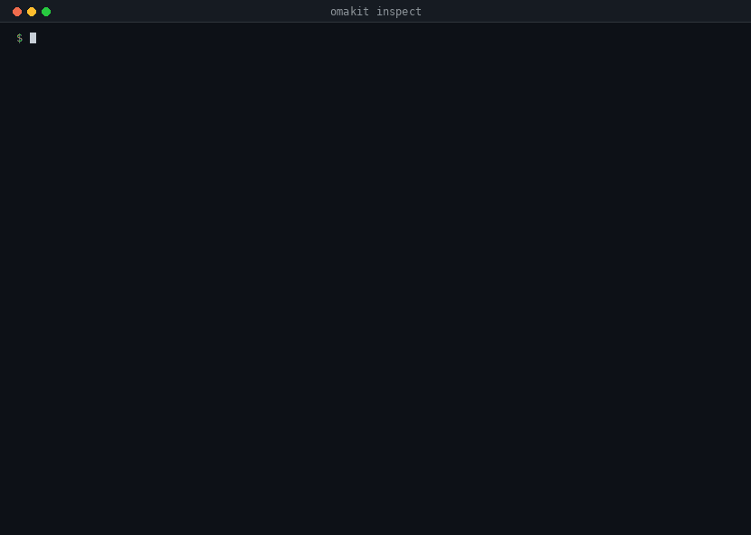

# The commands

This is the reference: every command, what it reads, what it prints, and what
it will not do. `omakit help` is the short list; each command that has a page
of its own is linked from its section, and [README.md](README.md) says which
page answers which question.

The expected user is a coding agent submitting a plugin on an owner's behalf,
so the tool is zero dependencies, plain ESM, one entry point and no build
step, and every command can end as one JSON document. The six skills that
ship with it, and what to read from that document, are in
[SKILLS.md](SKILLS.md).

The commands fall into four jobs, and this page is ordered by them: build (the
two blocks measured in
[M13](MEASUREMENTS.md#m13-what-the-review-blocks-on-over-one-week-of-comments-and-which-of-it-a-block-can-own)),
check, track, prove, and then what keeps the tool itself current.

| Command | Job | What it does |
| --- | --- | --- |
| `omakit add run <plugin-dir>` | build | copies the Run block into the plugin's `omakit/` directory; `--update` moves an unmodified copy |
| `omakit add store <plugin-dir>` | build | copies the Store block, with `run`, which it uses |
| `omakit inspect <plugin-dir>` | check | what a plugin tree does, as observations, and the review classes the tree shows |
| `omakit verify <plugin-repo>` | check | the official security baseline over the local transport; `--json` for the document |
| `omakit submit <plugin-repo>` | check | every check, and the exact issue title and body; asks for a category and tags at a terminal |
| `omakit watch <issue-url> [<subject>]` | track | the commit the marketplace validated, against the plugin's current HEAD; with the plugin's checkout or URL as the subject, the issue's Repository URL against its `origin` first |
| `omakit watch --all` | track | every open marketplace issue authored by your `gh` account; `--list` lists them; bare, a terminal chooses |
| `omakit audit [<plugin>]` | track | installed third-party commits against the commits the marketplace validated |
| `omakit weigh <plugin>` | track | what a plugin weighs on the shell, measured by restarting it without and with the plugin; asks first |
| `omakit lab prove <suite>` | prove | a suite in a disposable Omarchy guest, the guest's installed package printed and written: `run`, `store`, `weigh`, `weigh-evidence` |
| `omakit lab inspect` | prove | what the lab is pinned to, what is on disk and verified, what the host lacks; read-only, fetches nothing |
| `omakit lab setup` | prove | one consent, then the pinned ISO verified against its SHA-256 and signature, and one base; `--toolchain`, `--from`, `--plugins` |
| `omakit lab prune` | prove | what the lab owns on disk, asked once, removed, the bytes said |
| `omakit doctor` | current | what is installed, what is pinned, what has moved, and what the lab has |
| `omakit setup` | current | the environment, the pin, tab completion, and what to try first |
| `omakit pin` | current | what `setup` does for the pin, on its own |
| `omakit upgrade` | current | updates omakit through its own installer: npm, or a fast-forward |
| `omakit parity` | current | the baseline over GitHub versus the local transport, on real listings; writes the evidence |
| `omakit help --agent` | current | the operating instructions, for the agent running this |

## Build

One command writes into a plugin tree, and this is it. What it copies and why
that plumbing is worth taking from somewhere else are
[BLOCKS.md](BLOCKS.md) and [WHY.md](WHY.md).

### `omakit add`

`omakit add <block> [<plugin-dir>]` copies a block ([BLOCKS.md](BLOCKS.md))
into the plugin's `omakit/` directory: `run` is `Run.qml` and
`run-supervisor.py`; `store` is `Store.qml` and `store-helper.py`, with
`run`, which it uses; and `NOTICE`, each file with a header naming the
block, its version, the MIT licence, the copyright, the omakit commit and
the body's sha256. It is the
one command that writes into a plugin tree, and it writes those files and
nothing else: a file already there is not overwritten without `--update`,
and with `--update` a copy whose body is not one omakit shipped is refused,
before anything is written, because a modified block is the author's. The
report is one line per file, `written`, `updated` or `current`; `--json`
is the document. The plugin directory defaults to the current one and
has to carry a `manifest.json`. After it, `omakit inspect` lists each block
as one row, each `Run {` site as a process whose deadline the block holds,
and each `Store {` site as a write under the plugin's own state or cache
directory at mode 0600; a modified copy is reported as modified.

## Check

Three commands, read-only, in the order a submission is prepared: what the
tree is observed to do, what the official baseline says about it, and what
would be posted.

### `omakit inspect`

`omakit inspect <plugin-dir>` reads the plugin's tree at its commit and
prints what the text shows, in the order a reviewer reads it: every
`Process` with its argv, whether a deadline is observed for it and what
collects its output; every `http` or `https` literal with its host, the tool
it reaches and the timeout and size-cap flags beside it; every write with
whether its path falls under a directory the plugin controls; every `Timer`
with its interval; and the capabilities and findings the marketplace's own
baseline records for the same tree, through `verify`. Below the facts, one
row for each class the marketplace's human review has raised, printed only
where the tree shows the class's precondition and citing the class's measured
share of review findings ([M11](MEASUREMENTS.md#m11-what-the-human-review-raises-by-class)).
It is regular expressions over QML and shell, and every row says so: a
command that is not one literal is a `▒ ?` row with no argv, a section with
nothing in it says "observed nothing of this kind", and the report ends by
naming what the method cannot see. No verdict, no `--fix`: it runs
nothing from the tree, resolves no host and writes nothing into it, and the
one word it closes on is `INSPECTED`. The report opens with the size score,
the share of the plugin's function lines that sit in functions over the
measured size, placed among the listed trees' shares (10.00 when no
function is over, 0.00 when heavier than every listed tree), a position
to work towards and never a grade; then what needs
attention, biggest first: the functions longer, more branched or deeper than 90 of 100
functions in listed trees ([M12](MEASUREMENTS.md#m12-how-long-a-plugins-functions-are-in-listed-trees)),
longest first, then one block per review class the tree shows, ordered by
the class's measured share of review findings, with up to five sites under
each and the fact at each site; classes under five percent are counted, not
listed; `--full` is every site with every qualifier. `--json` prints the
document of [INSPECT.md](INSPECT.md), `--out` writes it to a file as well,
`--offline` skips the baseline section. Exit 0 with a report, whatever it observed; 2
when the target could not be read.

### `omakit verify`

`omakit verify` prints the official baseline result alone, with no Omakit
check around it: the subject, the pin, the transport and what the local
adapter assumes, then the marketplace's own outcome, each finding as a block
with its rule id, whether it blocks publication under the pinned policy, the
file and line, and the official text verbatim, then the marketplace's own
statement. `--json` prints the document itself under the envelope every
command carries (below), its own fields unchanged from earlier releases,
and `--out <file>` writes it; agents and the skills use those.
`submit --body-out <file>` writes the rendered issue body, and nothing
else, to a file: the retry edit protocol in the skills passes that file to
`gh issue edit --body-file` so the body posted is the one rendered, never
one retyped. A refusal renders no body and writes nothing.

### `omakit submit`

`omakit submit` reads the marketplace's registry first, and a run has three
outcomes. `READY`, exit 0: every blocking check passed and the title and body
follow. `REFUSED`, exit 1: a blocking check failed and no body is produced.
`LISTED`, exit 0: the plugin is already listed by its own repository (the
manifest id is in the catalog, and the listing's repository is the subject's
declared `origin`, compared as owner and name), so the submission form is not
the route. Nothing is wrong and nothing was refused: `identity.available`
passes with the listing's record (since when, which commit, verified or not),
the five checks that exist only for the body are omitted, nothing is asked,
and the closing block names the commit the marketplace lists, the local
commit, whether they are the same, and the marketplace's verification form
with the choice that lists a newer commit, read from the pin's
`verify-plugin.yml`. Measured on 0.1.6: this state printed `FAIL
identity.available`, `REFUSED`, and "Fix it, then run submit again" under a
remedy that said there was nothing to submit. An id taken by another
repository, a retired id or a reserved one is still refused. In `--json`, the
outcome is `outcome: "ready" | "refused" | "listed"`, `ready` stays a boolean
that is true for the first only, and a listed run carries a `listing` object.

An unlisted plugin needs a category and tags, and they are an editorial
choice nobody else can make: at a terminal it asks, once each, with the form's
own lists numbered and the marketplace's own default for the manifest's kinds
offered where it is on the list; in a pipe, from an agent, or with `--json` it
is the usage error with the same lists, exit 2. A listed plugin is asked for
neither. A `READY` or `REFUSED` report ends with the command line that repeats
the run without asking, and `--json` carries it as `reproduce`.

## Track

A submission is not the end of it. These three answer what happened after: to
the submission, to the plugins already installed, and to the shell they run
in.

### `omakit watch`

The optional second argument is the subject: the plugin's checkout or its
github.com URL, the current directory by default when it is such a
checkout and its root `manifest.json` is the plugin the issue names (a
directory that is another plugin is reported as not compared, never as a
mismatch). With one, the issue's Repository URL is compared with the
plugin's `origin` and a mismatch is `wrong-repository`, exit 1, before any
commit is compared. A failed marketplace validation newer than the last
baseline marker is `refused`, exit 1, with the marketplace's own code and
action. Account-wide watch without `--user` requires `gh auth login` so it can
discover your account. `--user <login>` can discover a public author's issues
without a login. An individual issue URL still works unauthenticated.
Discovery reads open authored issues, excludes pull requests, follows
pagination, and refuses an incomplete list. JSON, `--out` and pipes never
prompt: pass `--all`, `--list` or an issue URL. See
[VALIDATION_WATCH.md](VALIDATION_WATCH.md) for batch output and exit codes.

### `omakit audit`

`omakit audit` compares every installed third-party plugin's running commit
with the exact commits the marketplace records as validated, and changes
nothing. The states, the flags, the verdict and the JSON contract are in
[AUDIT.md](AUDIT.md).

### `omakit weigh`

`omakit weigh` measures what a plugin costs the shell from outside the
process, by restarting the shell without the plugin and with it. It asks
before it touches a running desktop. What it measures, what it does to
`shell.json` while it runs, and what the numbers do not say are in
[WEIGH.md](WEIGH.md).

## Prove

### `omakit lab`

`omakit lab <prove|inspect|setup|prune>` proves a suite in a disposable
Omarchy guest ([LAB.md](LAB.md)). `prove <suite>` boots nothing until the
base is ready, the host can run a guest and the suite's files are there,
and otherwise names what is missing, what it takes and the one command;
it fetches nothing, prints the guest's installed `omarchy` package and
whether the session runs from it before the suite, and writes that
identity into the document with the run id. `inspect` is read-only: the
pinned release with its exact size in GB and GiB, its digest and its
signer, what is on disk and whether it was verified, the toolchain, what
the host is missing. `setup` is the only path that fetches bytes: one
consent naming the exact size and the destination before the first byte
(`--yes` for an agent; a pipe without it refuses), a resumable GET of the
pinned URL or a copy of `--from <file>`, verified against the pinned
SHA-256 and the Omarchy signature before anything boots it, then one base
built by the pinned omarchy-iso toolchain, whose checkout `--toolchain
<dir>` records and which setup never fetches; `--plugins` adds the listed
plugins the weigh evidence suite needs. `prune` lists what the lab owns
with its bytes, asks once, removes only that, and says what it recovered.
`omakit doctor` gains the lab's lines, advisory.

## Keeping the tool current

### `omakit doctor`

`omakit doctor` names the credential source it found, or that it found none.

### `omakit setup`

`omakit setup` checks the environment, fetches the marketplace checkout that
every rule is read from, installs tab completion for the shell you run it from
and proves it in a new shell (`docs/INSTALL.md` says what it asks when the
shell has no loader)
(bash, zsh or fish, read from `$SHELL`), and tells you what to try first. It is
idempotent. The fetch takes about 2 seconds and 15 MB, because it takes only the
seven files omakit reads out of that repository rather than the 325 MB it is at
that commit. The completion script knows the subcommands and their flags,
completes a directory for `<target>`, and offers the categories and tags the
pin's submission form actually has. For `omakit weigh <TAB>` it offers the
plugin ids the running shell has installed, read at TAB time through
`omarchy-shell shell listPlugins` and `jq` (enabled ids first, whole bars
left out, since a bar cannot be weighed), and falls back to a directory
when the shell does not answer within a second. The decision behind that:
nothing starts a node process behind a TAB, because node's startup is not
something to put between a keystroke and its answer, and the ids are the
shell's to report, not a list to bake into a script that would go stale
the next time a plugin is added. The same pipeline is in the bash, zsh and
fish scripts, and `tests/unit/completion.test.mjs` runs its jq expression.

### Credentials and the network

If you have `gh auth login` done, omakit
reads that credential for GET requests and stores nothing; a token in
`GH_TOKEN` or `GITHUB_TOKEN` reaches it the same way, because `gh` honours
those itself. Without either, `watch` and `parity` share GitHub's
60-requests-an-hour unauthenticated allowance; `submit` reads two things
online, the subject's default-branch HEAD and the marketplace's current
registry, and `--offline` turns both off; `verify` on a local repository does
not touch the network at all (a `<url>@<sha>` target is fetched once, over
git, into the cache). omakit reads no environment variable of its own; the
cache and the state follow XDG, and colour follows `NO_COLOR`, `FORCE_COLOR`
and `TERM`, which are everybody's.

## The contract every command keeps

One layer, `tools/marketplace/outcome.mjs`, is the only way a command
ends, and `tests/unit/json-outcomes.test.mjs` runs every command through
every outcome it can reach offline and holds each row to this. Every failure
code, what it means and the one action for it are in
[FAILURES.md](FAILURES.md).

- **Exit status.** `exit 0` is success. `exit 1` is a refusal or a failure
  the tool means: a refused submission, drift, a validation that could not
  be compared, a lab that is not ready or a suite not proved, a plan a
  preflight refused, `doctor` finding a problem, an error the operating
  system raised. `exit 2` is a usage error: an option the command does not
  know, one without its value or given twice with two values, an empty
  argument, one positional too many, and a question a pipe could not
  answer (`--yes` absent where consent is needed). A stop asked for by a
  signal exits with the signal's own status, 128 plus its number: 129 for
  `SIGHUP`, 130 for `SIGINT`, 143 for `SIGTERM`, whether the command
  handled the signal (`weigh`, `lab`, which restore first) or not.
- **`--json`.** Exactly one document on stdout, whatever happened:
  `{ "command", "ok", "error", ...the command's own document }`. `ok` is
  true exactly when the exit is 0. `error` is null on success and
  `{ "code", "message", "remedy" }` otherwise, `message` one sentence with
  one full stop, the same sentence a person reads, `remedy` the one thing
  to do and never null (an operating-system error carries the remedy for
  its errno); a refusal that lists what is missing (`lab prove`, `lab
  inspect`) adds `error.missing` with each item's `what`, `cost` and
  `command`, and a submission refused for want of its editorial flags adds
  `error.usage` with the form's lists. A document that is a list (`weigh
  --list`) is carried as `rows`. The failure's sentence is written to
  stderr too, and nothing else is: a piped stderr is empty on success.
- **Streams.** The command's text (a report with its verdict, or the
  failure block) is on stdout when the exit is 0 and on stderr on any
  other exit, so stdout never carries a result a parser would mistake for
  a good one. A long-running command's live narration (`weigh`'s restarts
  and md5s, the lab's identity block and suite lines, `setup`'s steps) is
  written as it happens, on stdout for a person and on stderr under
  `--json`, and is not the result.
- **`--out FILE`.** The run's document, the same JSON `--json` prints, is
  written to the file on every outcome, a failure included, except a usage
  error, whose command line is refused whole and no option on it trusted;
  with `--json` stdout then carries nothing at all, and without it the text
  says where the file went. A file that cannot be written is itself the
  failure, and the document is then on stdout.
- **Leaving.** The text is written, both streams are drained, and only
  then does the process exit; a reader that closes early (`| head`) ends
  the command with the exit it had decided on. Nothing waits without a
  bound: every request carries a deadline (`GET_DEADLINE_MS`, 20 s to the
  first byte), every child process a `timeout`, and the test runner a
  per-test bound (`tests/unit/deadlines.test.mjs`).

Measured on 2026-09-19 by an acceptance tester of the packaged candidate:
seven commands shaped their documents seven ways, `lab prune --json`
printed nothing, `watch` exited 2 on an unknown verdict, `add` on `EACCES`
carried `remedy: null`, `lab inspect` and `audit` wrote a failing result to
stdout only, `SIGTERM` exited 143 where the documentation said 130, and a
failed `lab prove --json --out` created no file
(`docs/evidence/ux/2026-09-19-acceptance.json`, findings 2 and 3).

Every colour omakit prints is an ANSI palette index, so your Omarchy theme
decides what it looks like, and nothing is said by colour alone. What the
terminal shows and why is [TUI.md](TUI.md); which index each role
gets, measured over all 32 installed themes, is
[PALETTE.md](PALETTE.md).
