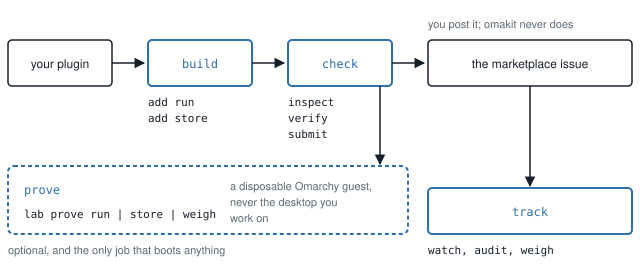
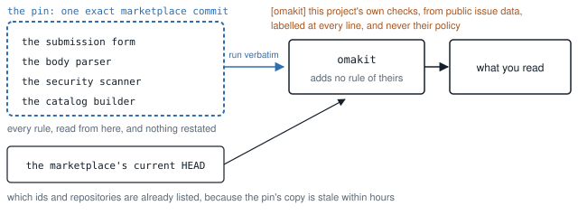

# What omakit is doing, and why

[COMMANDS.md](COMMANDS.md) says what each command decides; this page says
what the tool is built on: the numbers that made it, where every rule is read
from, why it is Node, and what the baseline result is and is not.

The commands fall into four jobs, and everything else follows that shape.

<picture>
  <source media="(prefers-color-scheme: dark)" srcset="media/how-jobs-dark.svg">
  
</picture>

*Build and check happen before anything is posted. Track is what happens
after. Prove is optional, and the only job that boots anything.*

Each job's commands are in [COMMANDS.md](COMMANDS.md), and each has a page of
its own, listed in [README.md](README.md).

## Why it exists

Four numbers, all measured on public marketplace data on 2026-09-12. Method,
limits and the rest of the figures: [MEASUREMENTS.md](MEASUREMENTS.md).

| Measured | Consequence |
| --- | --- |
| 39 submissions fell out on the title prefix alone, and 11 more are malformed in the body, one by a single word | the format is generated from the pinned form and judged by the marketplace's own parser |
| 1,215 of the 2,916 listings with a recorded baseline needed a human to look, because of a capability | the official baseline runs locally on the exact commit first, and names the capability |
| 103 issues mention agent-control files, which no automated check reports | submit names every one with its remedy, before a reviewer has to |
| The 2026-09-12 sample found stale validation in 68/93 readable issues; 46% of the maintainer's own revalidation requests never produced one | a validation watch that names the one action which re-runs validation |

It does not claim to unblock the maintainer. His review writing barely repeats,
his median time from submission to publication is hours, and the queue waiting on
him is a median half a day old. The honest size of what this saves him is the
staleness paragraph he has written by hand on 358 issues, roughly 5.5% of his
review writing. The rest of the benefit is the submitter's.
[MARKETPLACE.md](MARKETPLACE.md) states that in full.

## What it is doing

Nothing about the submission format is written down in this repository. The
title prefix, the six form headings in order, the nine categories, the thirteen
tags and the exact text of the five checklist items are all read from
`.github/ISSUE_TEMPLATE/submit-plugin.yml` in a marketplace checkout pinned to an
exact commit. The rendered body is then handed to the marketplace's own
`parseCurrentSubmission` from that same commit. If it accepts the body here, it
accepts it there. The one exception is data, not rules: the registry and the
catalog that say which ids and repositories are already listed are read from
the marketplace's current HEAD when the network is there, because the pin's
copy is stale within hours (4,201 of 4,293 commits in 30 days touched only
`registry.json`), and from the pin with `--offline`.

This is why the tool is Node: the marketplace's scanner, form parser and
catalog builder are Node modules, and omakit runs them verbatim from the
pinned commit instead of reimplementing their rules, where a different
language would mean a copy that can drift.

<picture>
  <source media="(prefers-color-scheme: dark)" srcset="media/how-rules-dark.svg">
  
</picture>

*The rules are not this project's to write. They are read from one exact
commit and run unmodified; what this project does add is labelled where it
is said.*

The security baseline is the marketplace's own code, imported unmodified and run
over a local snapshot with no network. Omakit adds no rule, renames no outcome,
and never restates the result as a safety claim: the baseline does no data-flow
analysis and is not a security review, and the output says so in the
marketplace's own words.

Every check is labelled. `[marketplace-pin]` is the marketplace's rule, read from
the pin. `[omakit]` is this project's own check, derived from public issue data.
Those are not marketplace policy and do not claim to be.

## The submit run

The plugin in the README's recording is refused for three things the
marketplace itself refuses, and warned about a fourth: it ships instruction
files an agent will read once installed. **103 marketplace issues mention
exactly that, and no automated check reports it, so today an author finds
out from a human review round.** It is a warning and not a refusal, because
the marketplace does list plugins that ship them: 6 of 34 inspected do, at
the commit that was listed.

Sixteen checks, each naming its source and, when it fails, the measured
reason it exists. A blocking failure produces no submission body at all,
because a refusal that still hands you the body is only a suggestion. Every
check and what it decides: [SUBMIT.md](SUBMIT.md).

## The watch

A submission can pass validation and pass the security baseline with zero
findings and still be stuck, because the marketplace validated one exact
commit and the only action that makes it validate a newer one is editing
the issue body. Pushing the fix does nothing. Commenting "fixed in `abc123`"
does nothing. **On 2026-09-15, 326/519 readable comparisons were stale (62.8%);
64 of 583 issues were unknown.** The watch, and why
it is the centre of the tool: [VALIDATION_WATCH.md](VALIDATION_WATCH.md).
