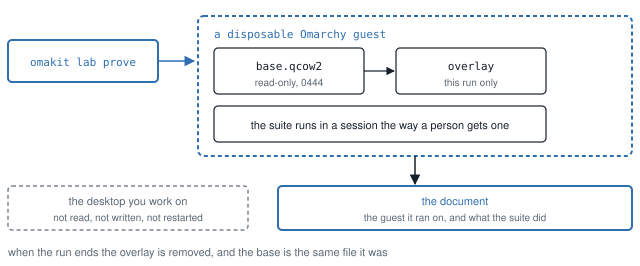

# The lab: `omakit lab`

The lab is the fourth job after build, check and track. A suite runs in a
disposable Omarchy guest, never on the desktop, and its document comes back
with the identity of the guest it ran on. This page is the contract: what
each of the four actions does and will not do, the trust anchor, what one
run costs in disk and time, the honest dependency on the omarchy-iso
toolchain and its patch, and what the lab does not do, with the condition
each one needs. The inventory this replaced, with its twenty-two problems, is
[history/2026-09-18-lab-inventory.md](history/2026-09-18-lab-inventory.md);
the design it implements is [packaging/LAB_PLAN.md](../packaging/LAB_PLAN.md);
the measurements are M14 in [MEASUREMENTS.md](MEASUREMENTS.md).

```bash
omakit lab inspect                   # read-only: the pin, what is on disk and verified, what the host lacks
omakit lab setup --toolchain <dir>   # record the omarchy-iso checkout, after hashing its harness against the pin
omakit lab setup                     # one consent, then the ISO, its verification, and one base; --from <file> for an ISO already downloaded
omakit lab prove run                   # the Run block's 19 scenarios in the guest; also store, weigh, weigh-evidence
omakit lab prune                     # what the lab owns on disk, asked once, removed, the bytes said
omakit doctor                        # the lab lines beside the others, advisory
```

<picture>
  <source media="(prefers-color-scheme: dark)" srcset="media/lab-run-dark.svg">
  
</picture>

*The base is never written to and the desktop is never touched. What a run
leaves behind is the document, and the document names the guest it ran on.*

## The boundary

Omakit ships the ability to acquire a lab. It never ships an ISO, an image,
a base disk, firmware variables, an overlay, or a compressed or renamed
form of one; `tests/unit/self-containment.test.mjs` sniffs every file in
the tree for a disk-image or archive signature, holds `package.json` to no
install hook, and holds `tools/lab/` to code, the pin, the key, a patch and
bash, plus the suites' in-guest inputs under `tests/lab/` and
`tests/fixtures/weigh/`. What ships is measured: 21 files under
`tools/lab/`, 212,533 bytes unpacked, and 23 suite files, 51,479 bytes, in
a package that packs to 371,388 bytes (`npm pack --dry-run` at 0.6.9, held
by `tests/package-assert.mjs` under its 409,600-byte ceiling).

No image is fetched implicitly. `inspect`, `prove`, `setup` and `doctor`
read Omarchy's release list once each (below), so the lab says when a newer
release is out; that read is a few GETs of metadata and one byte of each
ISO it considers (a range request, for the size), and `--offline` skips it. `prune` never
touches the network. `setup` is the one path that fetches an image, after
one consent that states the exact size and the destination, and `--yes` is
that consent in the command itself for an agent; a pipe without it refuses,
exit 2, naming `omakit lab setup --yes`, with the plan as the refusal's text.
A plan that cannot run (no toolchain, too little disk) is refused before
any consent is asked, exit 1, `lab-blocked`, and says what blocks it; what
no release changes (the host's commands, the toolchain when there is no
base) is refused before the release list is read, and the disk, which
depends on the release's size, after.

Nothing here touches the daily session. Every binary the lab's modules
spawn on the host is on a list `tests/unit/lab.test.mjs` holds them to
(`qemu-system-x86_64`, `qemu-img`, `ssh`, `gpg`, `git`, `uname`, `bash`
for the harness, and the `--version` probes); the harness and the suites
add `tar` and `node` on the host side of an ssh pipe, `magick` when it is
there, and `jq` in the weigh suite. The same test reads every file under
`tools/lab/` and refuses
a line that names `omarchy-shell`, `hyprctl`, `shell.json`,
`~/.config/omarchy`, `systemctl --user` or `quickshell` outside a command
sent into the guest over SSH. QEMU's argument list is pure and read by the
same test: no display, no host directory, no host socket, no device beyond
the tablet and the disk, one network device with SSH forwarded on
127.0.0.1 and nothing else forwarded. SSH goes to 127.0.0.1 with the
base's own key, no agent, no forwarding, no known-hosts entry.

## The newest release, and the trust anchor

The lab prepares the newest Omarchy release, found each time: until 0.6.9
it was pinned to one release, 4.0.3, and on 2026-09-23 it still offered
4.0.3 eight days after 4.0.4 was published, because nothing looked.
`tools/lab/release.mjs` reads the release list at
`https://api.github.com/repos/omacom/omarchy/releases`, skips drafts,
pre-releases and anything that is not three numbers, sorts by version (not
by the list's order), and takes the newest at or above the floor, 4.0.3,
whose ISO, `.sha256` and `.sig` are all published at
`https://iso.omarchy.org/omarchy-<version>.iso`. A newer tag whose objects
are not all there yet (the host answers 404; 4.0.0 never had a `.sha256`)
is passed over and named; anything else stops the search with its reason
(a timeout, a 5xx, a checksum that does not read, an ISO whose size is not
announced), because a fallback on any of those is the stale lab again. At
most three candidates are read, each for its checksum and signature and
the ISO's size, from a one-byte range request. A base newer than the
release found (a moment when that release's checksum is being republished,
or an offline `--from` of an older file) is `ahead`: kept and used, never
taken back a release, and nothing older is fetched or built over it.

What is fixed, in `tools/lab/pin.json`, is what the trust rests on: the
signer, `40DFB630FF42BCFFB047046CF0134EE680CAC571` (Omarchy
<pkgs@omarchy.org>), whose public key ships as `tools/lab/omarchy.gpg`, 632
bytes of armoured text, itself pinned by digest; the floor; and the two
URLs. The release list decides which release; the signature decides whether
a file is it. That answers the inventory's objection to "latest" (P13):
the old setup scraped a web page for the first ISO link and trusted a
checksum from the same host with no signature checked, so a substituted
pair passed. Here a substituted ISO with a matching substituted checksum
fails at gpg. The signer is read from the `.sig` packet before anything
else is asked for: a release signed by any other key stops the search
(`signer-changed`) and is not replaced by an older one the old key signed,
and a changed key is a new omakit, never a quiet fallback. Every signature
packet in the `.sig` is read, so one made during a rotation with both keys
is the pinned key's, as gpg will find.

A file is the release when, in this order, its byte count is the one the
ISO host announced, its SHA-256 is the one the `.sha256` published, the
`.sha256` fetched at verification still names that digest, and its
detached `.sig` verifies in a throwaway keyring (never the user's
`~/.gnupg`) against the packaged key at the pinned fingerprint. A
downloaded file, a file copied with `--from` and a file already on disk are
judged alike; a mismatch in any step fails closed: the file stays as
`.part`, nothing is recorded, nothing boots it, and the report says which
step and both values. A checksum that changed while setup ran is named as
what it is, the release republished, and `setup` reads it again. The guest
package a base runs must be its release's (`4.0.4-<rev>` for 4.0.4).

`--from <file>` is the newest release when the list can be read; offline it
names its own release by its file name (`omarchy-<version>.iso`, at or
above the floor), with its `.sha256` and `.sig` beside it, and the same
verification decides. A base keeps working when a newer release is out:
`prove` runs it and says so, `inspect` and `doctor` name the newer release,
and `setup` builds it, replacing the old base and the older downloads only
after the new base verifies.

`inspect` reports the verification as recorded (`verified.json` beside the
ISO: digest, signer, when) and whether the file's size and mtime still
match that record; `inspect --verify` re-hashes and re-checks the signature
now, about 15 s on the reference host (M14).

## What is on disk

```text
$XDG_CACHE_HOME/omakit/lab/            or ~/.cache/omakit/lab
  downloads/<sha256>/omarchy-<v>.iso   0444, with .sha256, .sig, verified.json (the release it is)
  base/base.qcow2                       0444, the backing file of every run
  base/firmware-vars.template           0444, copied per run, never opened writable
  base/id_ed25519, id_ed25519.pub       the guest's lab key
  base/manifest.json                    the identity below
  base/build/                           the toolchain's install log, timing, pacman.log, screenshots
  staging/                              a run's overlay and variables, a build in progress; removed on every exit path
  plugins/<id>/                         the listed plugins for weigh-evidence, at their validated commits
  toolchain.json                        where the omarchy-iso checkout is, and its harness digest
  lab.lock/holder.json                  the run that holds the lab
$XDG_STATE_HOME/omakit/lab/runs/<id>/  or ~/.local/state/omakit/lab/runs/<id>
  run.json                              the record
  <suite document>                      runlab.json, storelab.json or omakit-weigh.json, with `where` and `lab`
  host.log, qemu.log, *.png             what the harness printed, what QEMU printed, the checkpoints
```

Every write goes through one guard (`inLab`, `tools/lab/paths.mjs`) that
throws for a path outside these two roots; `tests/unit/self-containment.test.mjs`
holds every `writeFileSync` under `tools/lab/` to it, and the one rename
(a verified `.part` promoted, a staged base promoted) to the same guard.

The base manifest records the release (name, digest, byte count, URL), the
signer, the guest (the installed `omarchy` package read
over SSH in a verification boot, the kernel, the hostname), the disk (bytes,
SHA-256, virtual and allocated bytes), the firmware template's SHA-256, the
build (duration, the harness digest, the toolchain commit, the
verification boot's timings), when it was created and by which omakit,
kernel and QEMU. `inspect` and `doctor` judge it against the newest
release: `ready` (built from it, its guest the release's package),
`outdated` (a good base of an older release, or of the same release before
Omarchy republished its ISO: a run uses it, and `setup` builds the newest
and replaces it once that verifies), `ahead` (a good base of a newer
release than the one found: kept, never taken back), `mismatch` (a guest
that is not its release's package; `setup` replaces it), `invalid` (a disk without a complete
manifest, or a size other than the recorded one; it will not be booted),
`missing`. With the release list unread (`--offline`, or no network) the
base is judged against its own release and the report says the newest was
not looked up.

## A run

`omakit lab prove <suite>`, in order:

1. Preflight, reading only: the base is good for its own release, behind
   or not (a newer release is said beside the result, never a reason to
   refuse); KVM, QEMU,
   `qemu-img`, `ssh` and the OVMF firmware are there; the host has one and
   a half times the guest's 5120 MiB; the suite's files are in the
   checkout; the disk has room for one overlay (610,734,080 B, the largest
   of the 2026-09-18 runs, M14). What
   is missing is printed with what it takes and the one command, exit 1.
2. The lock: `lab.lock/`, made atomically; a QEMU answering on the recorded
   QMP socket, or a live holder pid, means held, whatever PID namespace it
   is in; a stale lock is reported and taken.
3. Staging, private to the run: `qemu-img create -b base.qcow2` for the
   overlay (the base is read-only in the chain and 0444 on disk), a copy of
   the firmware template, the QMP socket, the serial log.
4. QEMU as a child of omakit, not daemonised, with the argument list above,
   every logical CPU (as the toolchain's `-smp $(nproc)` gave the reference
   build) and 5120 MiB, SSH on the first free port from 2222.
5. The session the way a person gets one: SSH answers (35 to 46 s over
   the runs of 2026-09-18 on the reference host), the password is typed
   at the greeter through the virtual keyboard until a `Hyprland` process
   owned by the guest user exists (one round, 11 s, every time), the
   startup notifications are dismissed.
6. The identity, read from inside and printed before anything else, as the
   plan requires:

   ```text
   run           20260918-160936-run
   release       Omarchy 4.0.3
   newest        Omarchy 4.0.4 is out and this base is 4.0.3: the run uses the base there; omakit lab setup builds 4.0.4
   guest         omarchy 4.0.3-1 on 7.2.3-arch1-3
   iso sha256    03d60bc74306dca51f96e1a84b690871d8d606826b260edd0208962da8507d14
   base          created 2026-09-18T14:05:40.267Z; 6,182,264,832 B (6.182 GB / 5.758 GiB); disk sha256 c47c74a0...418d38a3
   tested        installed package omarchy 4.0.3-1
   skew          false: the installed package is the base's 4.0.3-1
   ```

   The run of 2026-09-18 printed no `newest` line; the one above is what
   the same base prints since 0.6.9, with 4.0.4 out. The run record and
   the suite's document carry `newest` and `behind` beside `pin`, and the
   PROVED line says when a newer release is out. `skew` is true when the
   session runs from a linked checkout (`OMARCHY_PATH` in
   `/etc/omarchy.conf` names one) or the installed package is not the
   base's release's; it is printed and written, never collapsed into
   "Omarchy 4.0.3". The old gates never wrote this line, and their
   session was in fact dev-linked (inventory P8).
7. The suite, through the one harness (`tools/lab/harness.sh`): its body is
   a bash file under `tools/lab/suites/` that gets `log`, `ssh_guest`,
   `ssh_session`, `wait_for_guest_state`, `capture_console`, `stage_tree`,
   `stage_paths`, `stage_plugin`, `guest_job`, `guest_file`,
   `guest_shell_healthy` and `RUN_DIR`; every value is an argument, none an
   environment variable. Its output streams to `host.log` and the terminal.
8. The document, read back and held to the suite's assertion (Run: `ok`
   over 19 scenarios; Store: `ok` over 15 with `foreign-owner` simulated;
   weigh: `shell.json` restored), then written with `where` and `lab`: the
   run id, the guest, the skew, the pin, the base's digest, the host.
9. The guest powered off (`systemctl poweroff` over SSH, then QMP
   `system_powerdown`, `quit`, then the signal), the overlay measured and
   removed, the base disk and the template checked unchanged by size,
   mtime and inode, the lock released, the record written; on the normal
   path, on a failure, and on SIGINT, SIGTERM and SIGHUP, each exiting
   with its own status (130, 143, 129).

The closing word is `PROVED` or `NOT PROVED`, with the suite's own reason;
a `NOT PROVED` report is on stderr, exit 1, `error.code: "not-proved"`.
`--json` prints the record under the common envelope; `--out` writes it, on
a failure too.

### The four suites

| Suite | Where the content is | What it proves | Document |
| --- | --- | --- | --- |
| `run` | `tests/lab/run/` staged with `blocks/run/` | The Run block's 19 scenarios in their own Quickshell instances on the stock guest, the shell untouched ([BLOCKS.md](BLOCKS.md)) | `runlab.json` |
| `store` | `tests/lab/store/` with both blocks | The Store block's 15 scenarios, the foreign owner simulated with `chown root` through a sudoers drop-in written into the run's overlay, which dies with the run | `storelab.json` |
| `weigh` | `bin/`, `tools/`, two fixtures | `omakit weigh` against a real shell: the smoke check ([WEIGH.md](WEIGH.md), the lab gate) | `omakit-weigh.json` |
| `weigh-evidence` | four fixtures and three listed plugins from `plugins/` | The five-run gate `docs/evidence/weigh/` carries; `--runs` shortens it | `omakit-weigh.json` |

The in-guest content lives with the tests, under `tests/lab/` and
`tests/fixtures/weigh/`, and ships in the package too, so an installed
omakit proves a suite without a checkout; a tree that lacks one of those
files is named as incomplete, with the tree's own entry point in the
remedy. `weigh-evidence` needs the three
listed plugins in the lab's plugin cache at the commits the pinned
catalog records as validated; `omakit lab setup --plugins` fetches them,
once, after the same consent (three shallow fetches, 6,836,224 B
allocated on 2026-09-18), and the suite fetches nothing. Both were
exercised on 2026-09-18: the fetch, and the forty-restart run recorded
as C1b in [MEASUREMENTS.md](MEASUREMENTS.md).

## What one run costs

Measured on the reference host on 2026-09-18 (M14, the record in
[evidence/lab/](evidence/lab/)): the Run suite took 2m 53.4s from the
lock to the record, of which 35 s to SSH, 11 s to the session; its overlay
allocated 413,470,720 B (0.413 GB / 0.385 GiB) and was removed (a first
run the same afternoon, whose document the gate then miscounted,
allocated 440,602,624 B); the base and the template were unchanged. The
Store suite, the same afternoon: 1m 48.5s, a 417,075,200 B overlay, 15 of
15 with the foreign owner simulated
([evidence/lab/20260918-161230-store/](evidence/lab/20260918-161230-store/));
the weigh smoke: 1m 47.0s, a 461,180,928 B overlay, three real restarts,
the restore and the interrupt
([evidence/lab/20260918-161929-weigh/](evidence/lab/20260918-161929-weigh/));
the weigh evidence gate: 32m 20.9s, a 610,734,080 B overlay, forty real
restarts, C1b in [MEASUREMENTS.md](MEASUREMENTS.md)
([evidence/lab/20260918-162602-weigh-evidence/](evidence/lab/20260918-162602-weigh-evidence/)).
A second pass on the release round's code, the same evening
([end-to-end log](evidence/lab/2026-09-18-end-to-end.log)): 2m 53.3s,
1m 46.7s and 1m 36.8s, every one PROVED. The guest takes 5120 MiB while
it runs.
The old harness retained a 1.01 GB overlay per run (packaging/LAB_PLAN.md
M7); this one keeps
none.

## Setup: what it costs and what it does

The disclosure, printed whole before the question, as it read on the
reference host on 2026-09-23, with the 4.0.3 download of an earlier setup
still beside it:

```text
Omarchy       release 4.0.4, the newest published (v4.0.4, 2026-09-15, found now
              in github.com/omacom/omarchy); the guest will run omarchy 4.0.4
download      6,185,304,064 B (6.185 GB / 5.761 GiB)
from          https://iso.omarchy.org/omarchy-4.0.4.iso
verify        SHA-256
              ddeded2758c48318d201dfdac905ecb28f570441883f0c052ea3cd5d05acf92d
              as published beside it, and the Omarchy signature
              40DFB630FF42BCFFB047046CF0134EE680CAC571, the key omakit ships
store         ~/.cache/omakit/lab
build         5m 57.8s measured with Omarchy 4.0.3 on the reference host (M14);
              download excluded
replacing     one older download (4.0.3), 6,260,666,368 B (6.261 GB / 5.831
              GiB), removed after the new base verifies; until then a run uses
              what is there
afterwards    verified ISO, one immutable base, and manifests
on disk       about 12,367,568,896 B (12.368 GB / 11.518 GiB): this ISO and a
              base the size Omarchy 4.0.3's measured (M14), before evidence;
              1,228,904,902,656 B (1228.905 GB / 1144.507 GiB) free now

Acquire and build this verified base now? [y/N]:
```

A newer tag passed over (tagged, its ISO not up yet) is named on a `newer`
line; with the base already built from the newest release and its ISO
verified, `setup` prints `PREPARED  Omarchy 4.0.4, the newest release: the
verified ISO and a ready base are there; nothing to acquire.` With the
release list unreadable and a good base on disk, it leaves the base as it
is and says the newest could not be looked up; with no base, that is the
blocker, and `--from` is the way through without the network.

With `--from <file>` the download line says `0 B` and the file is copied
(6,260,654,080 B in 4.6 s on the reference host with the source
page-cached, then 13.1 s to hash it and check the signature, by the file
times of 2026-09-18) and verified; with the ISO already verified, only
the build remains; with a base the toolchain built but a
verification boot never promoted (an interrupted setup), the build line
says `none` and the staged base is verified and promoted instead of built
again. The download is a literal GET to `<name>.part`, resumed by byte
range on the next run, refused when the server announces a length other
than the one it announced when the release was read, and never sent the
GitHub credential (the transport is the
one call site in `tools/marketplace/github.mjs`, and `iso.omarchy.org` is
the fifth host `tests/unit/read-only.test.mjs` allows).

The build: the toolchain's console driver (below) is copied into
`staging/build-<stamp>/bin/` and run there with `--install-only`, so its
`test-runs/` lands under the lab and never in the checkout; it drives the
real installer by screendump, OCR and virtual keystrokes, authorises the
lab's SSH key over a console login, and saves the disk. Measured
2026-09-18: 5m 57.8s. Then omakit's own driver boots the staged base once,
reads `pacman -Q omarchy` (35 s to SSH, 11 s to the session), refuses a
version other than the release's own (`4.0.4-<rev>` for 4.0.4) or a
dev-linked session, hashes the disk and
the template, makes both 0444, writes and fsyncs the manifest, and
promotes with one rename; a superseded base is moved aside first and
removed after, and the downloads of older releases with it. A build that
fails leaves its log under staging and promotes nothing; `prune` removes
it, and the old base, if there was one, is still the one a run uses.

The toolchain starts its guest with `-daemonize`, so the QEMU of a build
is not omakit's child. Measured on 2026-09-23: a 4.0.3 setup interrupted
at 09:49 left its QEMU running, a third of a core, writing the staged
disk eighteen minutes later, with nothing that would ever stop it, and
its QMP socket in `/tmp` where `prune`'s liveness check could not see it.
Now, when the driver exits for any reason, `setup` stops every QEMU whose
pidfile is under the build's staging directory and whose command line
(`/proc/<pid>/cmdline`) names that directory, so a reused pid is never
taken for it: SIGTERM, which QEMU takes as a clean shutdown, and SIGKILL
after fifteen seconds. A setup that has something to build also stops,
once it holds the lock, every build QEMU still running under staging,
which then can only be left by a setup killed before it could (SIGKILL, a
crash). `inspect` shows such a directory as active, with the pid, and
`prune` refuses to remove it while that QEMU runs and names the `kill`.

## The toolchain, honestly

Base preparation depends on `omarchy-iso/bin/omarchy-iso-test`, the
official ISO test harness, at commit `268bac16d351a21d867e37565738f458b11cb06c`
with `tools/lab/patches/omarchy-iso-test.patch` applied. The patch is the
working harness of the reference host, 351 lines, and it is what the
versioned plugin-lab patch was not (inventory P12): it knows the 4.0.3
installer's greeter (`Beautiful, Fun & Agentic Linux by DHH`; upstream
waits for a word 4.0.3 does not show), it replaces the upstream line that
installed six packages on the host at every invocation with a check (P10),
it checks the OVMF firmware is readable, it waits two seconds where
upstream waits for light text Tesseract loses, and it carries the
`--host-test`, `--dev-link` and `--discard-overlay` extensions, which the
lab no longer uses.

The toolchain stays pinned while the release moves: the harness drives
the installer by what it reads on the screen, so a release whose installer
reads differently can fail a build. That fails closed, with the build's
log, and the base there keeps working; a harness that cannot drive the
newest release is a toolchain update in a new omakit. From 4.0.3 to 4.0.4
the installer's greeter is unchanged (`omarchy-iso`'s configurator carries
the same tagline, and its one change before the 4.0.4 ISO, `b507a20`,
only makes `linux-omarchy` the default kernel).

omakit never fetches the toolchain and never applies the patch: `git
apply` is a verb this repository's sources may not name
(`tests/unit/read-only.test.mjs`). `inspect` prints the one command that
prepares it:

```bash
git clone https://github.com/omacom-io/omarchy-iso ~/.cache/omakit/lab/toolchain/omarchy-iso && git -C ~/.cache/omakit/lab/toolchain/omarchy-iso checkout --detach 268bac16d351a21d867e37565738f458b11cb06c && git -C ~/.cache/omakit/lab/toolchain/omarchy-iso apply <omakit>/tools/lab/patches/omarchy-iso-test.patch && omakit lab setup --toolchain ~/.cache/omakit/lab/toolchain/omarchy-iso
```

`setup --toolchain <dir>` hashes `<dir>/bin/omarchy-iso-test` and records
the directory only when the digest is the pinned patched one
(`8637e8cc...`); the upstream digest (`fbc236a6...`) is named as
unpatched with the `git apply` line, and anything else as unknown. The
check is on the file, never on git state, so a checkout that moved, was
edited, or was updated from upstream is caught at the next `setup` and
`inspect`: the toolchain line reads `missing` (the recorded path is gone)
or `unknown` (the harness hashes to something else), and a build refuses
before it starts. A run needs no toolchain at all: it needs the base.

What the toolchain needs on the host, probed and never installed: `socat`
(its QMP transport), `magick` and `tesseract` (it reads the installer's
screens), `ssh-keygen`, `python3` (its one-file bootstrap server). A run
needs none of these: omakit speaks QMP from Node and converts a screenshot
with `magick` only when it is there.

## Prune

`omakit lab prune` inventories what the lab owns: the download directory
(the verified ISO and its record, or a partial download; `--keep-iso`
keeps a verified one), the base in whatever state, inactive staging, the
plugin cache, a stale lock; `--records` adds the run records under the
state root, which are otherwise never touched. It prints each path with
its allocated bytes and the total, asks once (`--yes` for an agent; a pipe
without it refuses, exit 2, with the plan as the refusal's text), refuses
while a run holds the lock or a QEMU answers on a staged socket, removes
only those targets, never follows a symbolic link, and reports the bytes
recovered and the bytes remaining. Nothing to prune is a result, exit 0,
and under `--json` a document like every other.

## Doctor

`omakit doctor` gains `lab.kvm`, `lab.qemu-system-x86_64`, `lab.qemu-img`,
`lab.ssh`, `lab.ovmf`, `lab.memory`, `lab.gpg`, `lab.disk`, `lab.iso`,
`lab.base` and, when held, `lab.lock`, each with its measured reason and
the one command, every one advice and never a problem: the lab is
optional, and doctor installs nothing. `doctor --json` carries the same
facts as data (state, release, guest version, ISO digest, allocated
bytes, lock state).

## What happened to the inventory's problems

| Problem | What happened |
| --- | --- |
| P1 three drivers | One harness (`tools/lab/harness.sh`), three suite bodies under `tools/lab/suites/`, one lifecycle in `tools/lab/run.mjs`; the three `lab.sh` files are gone. |
| P2 the Store gate said Run | Gone with the copy. |
| P3 two pointer helpers | The lab defines none; `qmp-cli.mjs` presses a chord when a suite asks. Pointer scenarios are not in this round (below). |
| P4, P5 the sibling checkout, the `.lab.env` paths | Gone: no `OMAKIT_LAB_ROOT`, no `.lab.env`; the one location the lab reads is `toolchain.json` under its own cache, recorded by `setup --toolchain`, and omakit reads no environment variable of its own. |
| P6 the base inside the checkout, named by the ISO's file name | The base is `lab/base/`, one per lab, with a manifest; the ISO is under its digest. |
| P7 the fixed port | The first free port from 2222, recorded in the run. |
| P8 the dev-linked "stock" guest | Every run reads and prints the installed package and whether the session is linked; `skew` is written into the document. The evidence run of 2026-09-18 says `false`. |
| P9 `-smp $(nproc)` | Kept, deliberately: it is what the reference build measured, and no run has measured a smaller count. Recorded per run. |
| P10 host package install | Removed by the patch; `doctor` and `inspect` name what is missing and the `pacman` line, and install nothing. |
| P11 the sudoers drop-in | Kept, in the overlay, said so in the suite's comment and this page; the password is the harness's argument, not a literal. |
| P12 the stale patch | The packaged patch is the working one, pinned by the digest of the patched harness. |
| P13 "latest" and the sidecar-only check | The pin, the digest, the signature, the fingerprint; the sidecar compared and named. |
| P14 OCR tools for a run | A run needs `qemu-system-x86_64`, `qemu-img` and `ssh`; QMP from Node. |
| P15 the writable template | Copied per run; checked unchanged after every run. |
| P16 the named overlay and PID-based liveness | The overlay is removed on every exit path including SIGINT and SIGTERM, and measured first; liveness is a QMP answer on the socket, which crosses PID namespaces. What is not done is below. |
| P17 no time bound recorded | `durationMs`, the SSH and login seconds, and the overlay bytes are in every record. |
| P18 provenance by hand | `where` and `lab` are written by the driver. |
| P19 the base nobody could reproduce | Rebuilt on 2026-09-18 by `setup` from the verified ISO, 5m 57.8s, manifest recorded, verified by boot. |
| P20 refuse on the first missing thing | Every missing thing, with what it takes and the one command. |
| P21 node through mise shims | Still assumed by the weigh suite; a stock 4.0.3 has it. Below. |
| P22 no licence on the lab repository | Maarten's to add; the closing block of the round names it. |

## What the lab does not do

- It does not pass the overlay to QEMU as an unlinked descriptor
  (`packaging/LAB_PLAN.md`, the per-run overlay rule). The overlay is a
  named file under `staging/run-<id>/`, removed by omakit on the normal
  path, on failure, on SIGINT and on SIGTERM; a SIGKILL to omakit leaves
  QEMU running on it, the next `prove` finds the lock held by a QEMU that
  answers, and `prune` refuses while it answers. Decided for 0.6.0: it
  stays a named file. The descriptor form is a new mechanism (`-add-fd`,
  a qcow2 opened through `/dev/fdset`, a lock QEMU inherits) with its
  own proof, not a polish of this one, and the release round adds no
  feature. Condition: an fd-set boot proven on QEMU 11 with a qcow2
  whose backing file is resolved from its header, then the argument and
  its test.
- It does not hold a lock QEMU inherits. The lock is a directory with the
  holder's pid and QMP socket; the QMP answer is what crosses namespaces.
  Condition: the same descriptor work as above.
- It does not send pointer events. The toolchain's `qmp_pointer_tap` is
  not ported; `qmp-cli.mjs press <chord>` types keys. Condition: a suite
  that needs a pointer.
- It does not run a plugin's own scenario. The four suites are this
  repository's; the toolchain's `--host-test` contract (a bash file
  defining `omarchy_host_test`) is not offered. Condition: a plugin that
  ships one, and the same harness helpers under a stable name.
- It does not build a base without the toolchain. The installer is driven
  by screendump and OCR through `omarchy-iso-test`; omakit will not carry
  a second installer driver. Condition: none planned.
- It does not test the encrypted or the provisioned install. The base is
  the unencrypted flow with the default user. Condition: a pin for one.
- It does not check the guest's `node`. The weigh suite takes node through
  `~/.local/share/mise/shims`, as a stock 4.0.3 has it, and says so when
  it is not there. Condition: a guest without mise.
- It does not verify the base by hash before every run. The base and the
  template are 0444 and checked by size, mtime and inode before and after
  a run; their digests are in the manifest and `inspect --verify` does
  not re-hash the base. Condition: 6 s per run nobody has asked for.
- It does not resume an interrupted build. A build that stops leaves its
  staging directory and log; `prune` removes it and `setup` builds again.
  A built base whose verification boot was interrupted is promoted, not
  rebuilt.
- It does not retain a guest for inspection, and has no `--keep-overlay`,
  by design.
