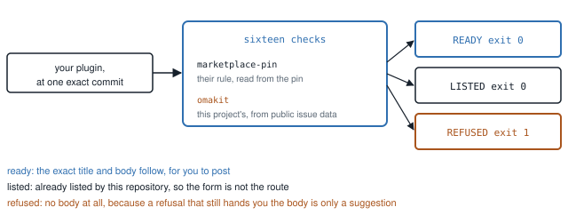

# `omakit submit`

One command, run before a submission is posted. It reports everything that is
knowable in advance, prints the exact issue title and body, and posts nothing.

```
omakit submit <target> --category <category> --tags <a,b> [--notes <text>]
```

`<target>` is a local Git repository path, or `<https url>@<40-char sha>` for
reviewing somebody else's commit read-only. The plugin's name and id come from
the root `manifest.json`; `--name` overrides the name.

<picture>
  <source media="(prefers-color-scheme: dark)" srcset="media/submit-run-dark.svg">
  
</picture>

*Every check names where its rule comes from, and a run ends one of three
ways. Nothing is posted by any of them.*

## What it refuses to do

It never creates the issue. Creating it happens only after the plugin owner
explicitly approves, which is also what the marketplace's own agent instructions
require. It never comments, labels, or opens a pull request, and there is no code
path in this repository that could: `tests/unit/read-only.test.mjs` proves that
no HTTP method other than GET exists anywhere in the tree.

When a blocking check fails, no body is produced at all. A refusal that still
handed you a body would just be a suggestion.

## The checks

Each check carries a source. `marketplace-pin` means the rule is the
marketplace's own, read from a pinned checkout at an exact commit, so a pin
update changes it. `omakit` means the check is this project's, derived from
public issue text; it is not marketplace policy and never claims to be.

| Check | Source | What it decides |
| --- | --- | --- |
| `plugin.root-manifest` | pin | Exactly one `manifest.json`, at the root, valid JSON, with an id. |
| `plugin.root-readme` | pin | A root README exists. |
| `plugin.root-license` | pin | A root license or COPYING file exists. |
| `plugin.readme-install-removal` | omakit | The README mentions installing and removing, because the generated checklist signs that claim. Keyword probe, not a reading. |
| `tree.agent-control` | omakit | Advisory: names every agent-control file in the installable tree. It never refuses, because the marketplace lists plugins that ship them (6 of 34 inspected). |
| `identity.available` | pin | The plugin id is unused, not retired, outside the reserved namespace, and the repository is not already listed; or the plugin is listed by its own repository, which passes with the listing's record (see below). The registry and catalog it reads are the marketplace's current HEAD when online, the pin when not (`--offline`, or no network); the detail names which, with the commit. The remedy follows the cause, one arrow each in this order: leave the reserved namespace; a retired id cannot be reused; an id taken by another repository names that repository; a listed repository whose manifest carries another id is sent to the marketplace's verification form (the form's choice text is read from the pin). In `--json` such a `remedy` is an array. |
| `submission.title` | pin | The title is the form's own prefix plus the plugin name. |
| `submission.category` | pin | Exactly one category from the form's controlled list. |
| `submission.tags` | pin | One to three tags from the form's controlled list. |
| `submission.repository-url` | pin | A public GitHub repository root URL, taken from `origin`, never invented. |
| `submission.headings` | pin | The six form headings, in the form's order. |
| `submission.checklist` | pin | All five checklist items, exact text, checked. |
| `submission.official-parser` | pin | The marketplace's own `parseCurrentSubmission` accepts the rendered title and body. |
| `submission.validation-commit` | omakit | The local commit is the repository's current default-branch HEAD, because that is what the marketplace will actually validate. |
| `submission.issue-repository-url` | omakit | Your open submission issue for this plugin, found by its Repository URL, or by the manifest's name in the title or its id in the body when the URL does not match, says the same Repository URL as `origin`. Skipped with `--offline`, without a credential, and when there is no such issue. Blocking: on #7787 a retyped retry edit put `mtolhuijs` where origin says `mtolhuys` and was refused as `repository-unreachable` 40 seconds later (M15). The remedy is the retry edit protocol in the submit skill: never the URL typed by hand. |
| `baseline.preflight` | pin | The official security baseline over a local snapshot, verbatim, plus what its outcome will cause. |
| `review.cost` | omakit | Advisory, immediately after the baseline: whether the update needs manual baseline review and whether this account already has open issues for the same repository. M4 and M9 measure the reason. |

Every one of them states its measured reason in the output when it fails, and in
the source either way. The numbers are in [MEASUREMENTS.md](MEASUREMENTS.md).

## Three outcomes

A run ends one of three ways, `outcome` in `--json`:

| Outcome | Exit | What it means |
| --- | --- | --- |
| `ready` | 0 | Every blocking check passed. The issue title and body follow, and `ready` is `true`. |
| `refused` | 1 | A blocking check failed. No body is produced; the closing block lists the root causes, then "Fix it, then run submit again" and the command line that repeats the run. |
| `listed` | 0 | The plugin is already listed by its own repository, so the submission form is not the route. Nothing was refused and nothing is wrong. |

`listed` is decided at `identity.available`: the manifest id is in the
catalog, and the listing's repository is the subject's declared `origin`,
compared as owner and name, case-insensitively, with a trailing `.git`
ignored. The check passes and its detail is the listing's record, read from
the catalog at HEAD or, offline, at the pin, and it says which: "listed by
this repository since `<addedAt>`, verification commit `<sha>` (`<status>`,
checked `<time>`)". The five checks that exist only for the body (category,
tags, headings, checklist, official parser) are omitted, not drawn as
questions waiting on identity, because no body is being rendered on purpose;
nothing is asked for, with or without a terminal. The closing block is
`▁ LISTED`: the commit the marketplace lists, the local commit, whether they
are the same, and the marketplace's verification form with the choice that
lists a newer commit, both read from `verify-plugin.yml` at the pin and
cross-checked against the marketplace's own verification module. No "Fix it"
line and no reproduce line. In `--json`, `ready` is `false` and `listing` is
`{ repository, id, addedAt, verificationCommit, verificationStatus,
verificationCheckedAt, localCommit, sameCommit, source: "head" | "pin",
updateRoute: { form, choice } }`.

Measured on 0.1.6: `omakit submit` on the author's own listed plugin printed
`FAIL identity.available`, `REFUSED 1 blocking check failed`, and closed with
"Fix it, then run submit again" plus the reproduce line, while the remedy
under the check said there was nothing to submit. A healthy state was drawn
as a failure, and the closing line contradicted the remedy.

An id taken by another repository, a retired id, a reserved id, or a listed
repository whose manifest carries an id it does not list are all still
`refused`, with the remedies above; when the only blocking check is
`identity.available`, the closing line keeps "Fix it, then run submit again"
and the reproduce line, because a new id is a fix.

A check has four verdicts. `pass` and `fail` are its own. `unknown`, drawn as
`▒ ?`, is a check that could not run because one it depends on failed:
`submission.headings`, `submission.checklist` and `submission.official-parser`
read the rendered body, so when the title, the category, the tags or the
repository URL failed, they say which check they waited on, and they count in
neither `blocking` nor `advisory`. `submission.validation-commit` reads the
default-branch HEAD of the repository URL, so without an origin it waits on
`submission.repository-url` rather than failing as a HEAD that could not be
read (measured on 0.4.1: it was listed as a second root cause, with the
detail "could not read the default-branch HEAD (unknown): ", for a read that
was never attempted). The closing refusal lists root causes only
and says how many checks waited on them. Measured before this: a run with no
`--category` and no `--tags` on a listed plugin said "6 blocking checks failed"
for two causes.

`skipped`, drawn as `▔ skip`, is a check that was not made because a flag said
not to: `--offline` skips `submission.validation-commit`, whose detail then
reads "not checked (--offline). Local commit <sha>." It never blocks, it is
listed under `skipped` in `--json` and not under `unknown`, and a READY run
says so on the READY line: "every blocking check passed. 1 check skipped
(--offline)." Measured on 0.1.6: that check came out `"verdict": "pass"` and
was drawn `▁ ok` under `--offline`, for a comparison that never happened.

The category and the tags are decided after the registry is read, not before.
A plugin that is already listed, by its own repository or by another, is
asked for nothing (measured on 0.1.5: the tool exited 2 asking for
`--category` and `--tags`, then would have said there was nothing to submit). For an unlisted
plugin they are an editorial choice nobody else can make, so nothing is
rendered without them: when stdin and stdout are both terminals and `--json`
is absent, `submit` asks, once each, with the form's lists numbered and the
marketplace's own presentation for the manifest's kinds (read from the pinned
`build-catalog.mjs`: `bar-widget` is Widgets, `overlay`, `panel` and `bar` are
Desktop, `service` is System, and the tags are the first three kinds) offered
as the default where it is on the list; Enter takes the default, an invalid
answer is asked again with the reason, and nothing typed is written anywhere.
In a pipe, from an agent, or with `--json`, it is a usage error: exit 2, the
missing flag(s) named, the lists under it, and `--json` carries
the failure document every command prints, with the form's lists under
`error.usage` (`missing`, `categories`, `tags`, `maximumTags`). Whatever
the source of the values, the report ends with the command line that repeats
the run without asking, and `--json` carries it as `reproduce`; a `listed`
run has no such line to print, because there is no run to repeat.

## Nothing about the format is written down here

The title prefix, the six headings, the nine categories, the thirteen tags and
the exact text of the five checklist items are all read from
`.github/ISSUE_TEMPLATE/submit-plugin.yml` in the pinned checkout. The maximum
tag count comes from the pinned `scripts/submission.mjs`. The reserved plugin-id
namespace is read out of the pinned `scripts/build-catalog.mjs` next to the
marketplace's own `reserved-plugin-id` check. The listed ids, the retired ids and
the listed repositories come from `registry.json` and `site/catalog.json`, and
those two files alone are read from the marketplace's current HEAD when the
network is there, because the pin's copy is stale within hours
([MEASUREMENTS.md](MEASUREMENTS.md) M7); with `--offline`, or when HEAD cannot
be read, they come from the pin, and the output says so either way.

The form and the marketplace's own constants are then cross-checked against each
other. If they disagree, `omakit submit` refuses to generate anything and says
which halves diverged, because generating a body from half of an inconsistent pin
is how malformed submissions happen.

## What `baseline.preflight` does and does not say

It runs the marketplace's own `runSecurityBaseline` from the pinned commit, over
a local Git transport, and reports the result verbatim beside what the pinned
policy says that result causes:

| Outcome | What it causes |
| --- | --- |
| no findings, no capabilities | `passed`: nothing in the baseline holds the submission back |
| no findings, one or more of the seven capabilities | `review-required`: a maintainer must look at this exact commit |
| any finding | `needs-fixes`, but only `sudoers-dangerous-passwordless-command` and `privileged-process-control-from-shared-temp` block publication under the current `selective` enforcement mode; the other three carry a `review-required` disposition a maintainer may accept |

The outcome derivation, the disposition, the blocking rule set and the
enforcement mode are read from the pinned `security-baseline-policy.mjs`. None of
them is restated in this repository, and no outcome is renamed.

This is not a safety claim and the output does not make one. The baseline
performs no general data-flow analysis and is not a security review. `submit`
prints the marketplace's own two closing sentences on this, read out of the
marketplace's own report builder at the pin, and it never constructs the
machine-readable attestation marker the marketplace's bot posts.

## Review cost before opening another issue

`review.cost` follows `baseline.preflight` and is always advisory. A
`review-required` baseline reports **manual queue**, names the capabilities,
and explains that every update of this plugin, including a docs-only one,
lands in the manual queue. If the account's `watch --all` discovery finds N
open issues for this repository, it reports **manual queue, again** and says
"consider batching: close or fold the open one before opening another".
Both use the existing advisory `fail` verdict, drawn as a note, and never
block readiness or remove the generated body. A `passed` baseline reports
**automated**, using `pass`: the update will not need a human for the security
baseline. This does not promise approval or publication. M4 and M9 in
[MEASUREMENTS.md](MEASUREMENTS.md) give the measured reasons.

The extra discovery reads the signed-in account and the fresh bodies of the
same open issues that `watch --all` finds, matching repository owner and name
case-insensitively and ignoring `.git`. Since 0.6.4 it runs on every online
`submit`, not only when the baseline lands in the manual queue, because
`submission.issue-repository-url` reads the same issues; one read serves both. No comments, labels or issues are
written. Under `--offline`, without a credential, or if the reads fail or are
incomplete, the count is silently omitted from the text advice. JSON keeps
`openIssuesForRepository: null` and the source-honest reason, never zero.
An automated baseline does not need that discovery. A baseline that has
findings or did not complete gives an `unknown` review-cost check, rather
than predicting human review before those findings are resolved.

Submit JSON adds this top-level object:

```json
{
  "reviewCost": {
    "outcome": "manual queue, again",
    "capabilities": ["installer"],
    "openIssuesForRepository": 2,
    "reason": "manual queue, again: capabilities installer. Every update of this plugin, including a docs-only one, lands in the manual queue. You already have 2 open issue(s) for this repository. watch --all discovery: 2 open issue(s) for this repository"
  }
}
```

`outcome` is `"manual queue"`, `"manual queue, again"`, `"automated"`, or null
when the baseline does not support a prediction. `capabilities` contains the
baseline's capability ids, `openIssuesForRepository` is an integer or null,
and `reason` explains the prediction and discovery source or skipped read.
`checks` adds `review.cost` immediately after the baseline, with
`severity: "advisory"`; it never appears in `blocking`. Existing submission
outcomes, issue bodies and exit meanings stay the same.

## After submitting

The marketplace then validates one exact commit, and the only action that makes
it validate a newer one is editing the issue body. See
[VALIDATION_WATCH.md](VALIDATION_WATCH.md).
