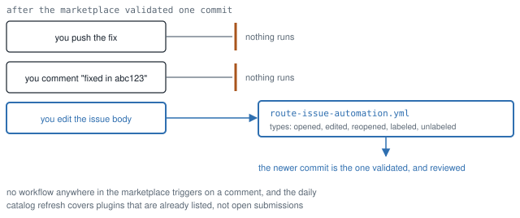

# `omakit watch`: the validated commit

```
omakit watch https://github.com/omacom/omarchy-plugin-marketplace/issues/<number> [<subject>]
```

Reads one submission issue and answers one question: is the commit the
marketplace validated still the commit the repository is on? With a
subject, the plugin's checkout or its github.com URL (the current
directory when it is such a checkout and nothing is given), it answers a
question that comes before that one: does the issue name this repository
at all?

## The subject

The marketplace validates the Repository URL in the issue, whatever it
says. On omacom/omarchy-plugin-marketplace#7787 (2026-09-20, 19:18 UTC) a
retry edit typed by hand put `mtolhuijs/omacrunch` where origin says
`mtolhuys/omacrunch`, the marketplace refused it as
`repository-unreachable` 40 seconds after the edit, and `omakit watch`
reported the 404 as `unknown`, "HEAD could not be read": the symptom, with
the cause hidden behind it, because the watch had never seen the plugin's
own origin. With a subject the issue's URL is compared with `origin`
(https, no `.git`, no trailing slash, owner and name case-insensitively),
and a mismatch is the verdict `wrong-repository`, over every other state,
with the origin to put back. `--json` carries `plugin.origin` and
`plugin.repositoryMatches` (`true`, `false`, or `null` when there is no
subject or the issue names no repository); `--all` has no subject and
compares nothing.

A failed validation is read as well. The last `<!-- marketplace-validation
-->` comment is either passed, with the short commit, or failed, and a
failed one is mapped back to the marketplace's own code through the pinned
`submission-feedback` table (37 codes at the pin; a reason the table does
not know is reported verbatim as `unrecognised`). The marketplace edits
that comment in place on every run, so the time of a refusal is the
comment's `updated_at`. A refusal newer than the last baseline marker is
the verdict `refused`; a marker newer than the refusal is the state again.
On #7787 the marker said 16:12 and the refusal 19:19:13; at 19:34:52 the
corrected retry wrote a newer marker. The labels the marketplace uses
(`needs-fixes`, `security-needs-fixes`, `validated`,
`security-review-required`, all read from the pin) are reported under
`labelState`.

## Your account's issues

```bash
omakit watch --all
omakit watch --list
omakit watch
omakit watch --all --user <login> --json --out <file>
```

`--all` checks every open issue authored by the account signed in through `gh`. `--list` reads only issue metadata and prints commands for checking individual issues. With no URL or mode, stdin and stdout must both be terminals: a numbered picker accepts one list number, comma-separated list numbers, `all`, or `q` to cancel. JSON, `--out` and pipes never prompt. An empty account exits successfully and reports no open issues.

`--user <login>` selects a public account explicitly; it needs no login lookup and works unauthenticated within GitHub's rate limit. Discovery is limited to the pinned marketplace repository, excludes pull requests and closed issues, and follows repository-issue pagination rather than search's result cap. It refuses a list exceeding 100 pages instead of presenting it as complete. General issues are retained: if no plugin repository or baseline can be read, their validation is reported as unknown.

The batch checks at most four issues concurrently and shares the default-branch HEAD read when multiple issues concern one repository. One read failure leaves an explicit error row and does not discard the other results. It checks fresh issue bodies, uses the same pinned form parsers and baseline-marker parser as a single-issue run, and never edits, comments, labels or publishes. Comment reads exceeding ten pages fail explicitly rather than comparing an older baseline as if it were the latest. Each invocation is one snapshot; it does not subscribe to notifications or poll in the background.

The text report shows each issue's commit verdict, baseline outcome and capabilities, current state and labels, and the latest human discussion other than the author's (up to 240 characters, with a source link). A bot account (GitHub's `type: "Bot"`, or a `<name>[bot]` login) is neither discussion nor a reviewer, and does not date the "after the last human review comment" clause. That discussion is not classified as an authorized maintainer decision. A current commit may still need fixes, review, approval or publication; `current` is only the commit comparison. Single-issue JSON adds the full `discussion` record or null, preserving the original text.

List JSON has `mode: "list"`, `account`, `marketplace` and `issues` (number, URL, title, state, labels and update time). Batch JSON has `mode: "all"`, `account`, `marketplace`, `summary` (total/current/stale/refused/unknown), and `issues` with each discovered issue, its full single-issue `report` or null, and its read `error` or null. An empty account or cancelling the picker returns an empty batch. Exit 0 means the list or comparisons completed, including stale results. Exit 1 means at least one comparison is unknown (the document carries `error.code: "unknown"` beside the batch), or at least one issue is refused (`error.code: "refused"` when none is unknown), or discovery failed, which cannot be mistaken for an empty account. Exit 2 means the invocation is invalid.

Regression proof: [watch-all.test.mjs](../tests/unit/watch-all.test.mjs) covers account selection, filtering, pagination, incomplete lists, shared HEAD reads, independent failures, multi-selection, cancellation, EOF, output wrapping and noninteractive mode conflicts.

## Review-cost snapshot in `--all`

One summary field below the counts measures how many listed issues are
`plugin-update` issues on `security-review-required`, and how many of those
have docs-only validated diffs. It gives the numbers compared and skipped;
each skipped issue row names the reason. M9 in
[MEASUREMENTS.md](MEASUREMENTS.md) records the population evidence behind
this measurement. The live summary counts this invocation's listed issues.

The compare API reads the latest baseline-marker commit against the most
recent different validated commit recorded before it: an earlier issue
baseline marker, the current listing or listing history from the registry,
or successful upstream validation from the catalog. The registry and catalog
are read together at current marketplace HEAD. No parent commit or author
description is substituted. Missing previous commits and incomplete or
unavailable comparisons give `docsOnly: null` with a reason. A diff is
docs-only when it is nonempty and all changed paths are under `docs/`, end
in `.md`, are named `LICENSE`, or use an image extension (`png`, `jpg`,
`jpeg`, `gif`, `webp`, `svg`, `ico`, `avif`, `bmp`, `tif`, `tiff`). Matching
is case-insensitive; a rename must qualify at both ends. Empty diffs do not
count as docs-only updates. Comparisons at the API's 300-file limit or
between diverged snapshots are skipped rather than treated as complete.

Batch JSON adds `reviewCostSummary: { pluginUpdates, manualQueue, docsOnly,
compared, skipped: [{ issue, reason }] }`. A compared or skipped issue row
adds `documentationDiff: { previousCommit, validatedCommit, docsOnly, files,
source, reason }`; `files` is the file count and `source` is the compare API
URL. Unavailable values are null. An unreadable issue has
`documentationDiff: { docsOnly: null, reason }` and retains its existing
`error`. Single-issue JSON adds `previousValidated` (commit, checkedAt and
marker source, or null). Diff availability does not change the existing
current/stale/unknown counts or exit status.

## The mechanism

The marketplace validates one exact commit, and the review that follows is of
that commit. The only action that makes it validate a newer one is **editing the
issue body**.

- `route-issue-automation.yml` is the only workflow with a direct `issues`
  trigger: `types: [opened, edited, reopened, labeled, unlabeled]`.
- There is no `issue_comment` trigger anywhere in the marketplace. A comment
  triggers nothing.
- `refresh-catalog.yml` does compare branch HEADs on a daily cron, but only for
  plugins that are already listed, and it does not rerun the snapshot security
  baseline. Open submissions fall outside it.

So pushing a fix does nothing, and commenting "fixed in `abc123`" does nothing.
Both feel like progress and neither is.

<picture>
  <source media="(prefers-color-scheme: dark)" srcset="media/watch-stale-dark.svg">
  
</picture>

*Two of the three things an author reaches for change nothing at all. This is
what the command exists to notice.*

## Why this is the centre of the tool

On 2026-09-15, all 583 open submissions labelled `needs-fixes` or
`security-needs-fixes` were attempted. Of 519 readable bot-commit versus
`commits.atom` HEAD comparisons, 326 were stale (62.8%), 193 current and
64 issues unknown. [The dated per-issue data](evidence/staleness/2026-09-15.json)
records both commits and the reason when a comparison was unavailable. The
62.8% is a share of readable comparisons, not all 583 issues.

The old 2026-09-12 figure came from 68/93 readable issues (73.1%) in a
100-issue sample from a 464-issue queue. The original per-issue pairs were
not found; recovered notes establish the sample denominator. The old sample
and the new full-queue attempt cannot establish a trend by themselves.

The instruction that would fix this exists. `scripts/submission-feedback.mjs`
contains "edit the issue" 22 times, every one attached to a deterministic
failure. `scripts/validate-submission.mjs` builds the success comment and
contains it zero times, and the success path is the path 97 of 100 parked
submissions took. Full figures and method in [MEASUREMENTS.md](MEASUREMENTS.md).

## What it reads, and what it will not do

It reads the issue, its comments, and the plugin repository's current
default-branch HEAD. The validated commit is not scraped out of prose: it is
parsed with the marketplace's own `findLatestSecurityBaseline` and
`parseSecurityBaselineMarker` from the pinned commit, so the commit compared is
the one the marketplace itself attested. When no marker exists, the short commit
from the validation comment is reported as what it is, too short to compare
reliably, rather than guessed at.

It never edits the issue, never comments, never labels, never opens a pull
request. The one action that re-runs validation is the author's to take, and the
command says so in the marketplace's own register.

Authenticated it reads the default branch through the REST API. The credential
comes from your `gh` login, and only from there; `gh` itself honours a token
in `GH_TOKEN` or `GITHUB_TOKEN`, so an agent with one in its environment is
covered without omakit reading it. Without a login it falls back to the
repository's public commit feed, which does not consume the 60-requests-per-hour
unauthenticated allowance. Nothing is written anywhere: the credential is read
when a request is about to be made, used for GET, and discarded with the
process. `omakit doctor` names the source it found.

## Two real runs

Both verdicts, against real open submissions on 2026-09-12, verbatim. The
command does not print the author's login: the text rendering ends up pasted into
issues, reports and screenshots, and the login adds nothing that the repository
URL does not already say. It is still in `--json` for callers that need it.

```console
$ omakit watch https://github.com/omacom/omarchy-plugin-marketplace/issues/4403
issue         https://github.com/omacom/omarchy-plugin-marketplace/issues/4403
state         open; labels submission, needs-fixes, security-needs-fixes,
              security-review-required
title         [Plugin]: One-Time Codes
plugin repo   https://github.com/fooblahblah/omarchy-otp

validated     de02fb5aa7243c0f84afa0442d16b50ba39144c1
              outcome passed, 0 finding(s), 0 capability/ies, checked
              2026-09-02T12:04:41.368Z
current HEAD  1ce9f4c189f78ad352915e868dd5a200fdeb006c
              main branch, via api, 2026-09-03T10:27:18Z

█ VALIDATION STALE  The validated commit is
                    de02fb5aa7243c0f84afa0442d16b50ba39144c1. The repository's
                    current main-branch HEAD is
                    1ce9f4c189f78ad352915e868dd5a200fdeb006c. The marketplace
                    has not seen the newer commit. Pushing it did not tell the
                    marketplace, and neither did any comment. The newer commit
                    landed after the last human review comment on this issue.

→ Edit the issue body. That is the only action that re-runs validation and the
  security baseline against a new commit: a push does not, and a comment does
  not.

Read-only. This command did not comment, label or edit anything. Comments on the
issue: 4 (1 from the author, 1 from a reviewer).
```

That submission's automated baseline passed with zero findings. It is not waiting
on a security problem. It is waiting because the commit that fixed the review
comments was pushed and never offered, which is the 9-of-13 case in
[MEASUREMENTS.md](MEASUREMENTS.md).

The other verdict, on a submission whose author did work it out:

```console
$ omakit watch https://github.com/omacom/omarchy-plugin-marketplace/issues/4829
validated     bc2f75cf15f7827511d79a7afa1680198e79c8ef
              outcome review-required, 0 finding(s), 3 capability/ies, checked
              2026-09-07T07:01:52.811Z
current HEAD  bc2f75cf15f7827511d79a7afa1680198e79c8ef
              main branch, via api, 2026-09-04T22:25:20Z

▁ VALIDATION CURRENT  The validated commit is
                      bc2f75cf15f7827511d79a7afa1680198e79c8ef, which is the
                      current main-branch HEAD. Nothing needs refreshing.
```

This is the one the underlying measurement caught mid-flight: on 2026-09-12 it
was recorded with a validated commit of `f16bb9ba` against a HEAD of `bc2f75cf`,
and by the time of this run the author had re-offered the newer commit. `current`
means the submission is genuinely waiting on a person, and the right response is
to read the review comments rather than to touch the issue.

## Verdicts

| State | Meaning | Exit |
| --- | --- | --- |
| `current` | The validated commit is the current default-branch HEAD. Nothing to do. | 0 |
| `stale` | The marketplace has not seen the newer commit. Editing the issue body is what refreshes it. | 0 |
| `wrong-repository` | The issue's Repository URL is not the subject's `origin`, so the marketplace is validating another repository, or none. Wins over every other state. The action is the retry edit protocol in the skills, with the origin to put back; `error.code: "wrong-repository"` under `--json`. | 1 |
| `refused` | The marketplace's last validation failed, and that refusal is newer than the last baseline marker. The report carries the marketplace's own code, reason and action, read from the pin; ranks below `wrong-repository` and above `unknown`; `error.code: "refused"` under `--json`. | 1 |
| `unknown` | No validated commit to compare, an incomplete baseline, or an unreadable HEAD. Never reported as `current`; a refusal the tool means, with the report on stderr and `error.code: "unknown"` under `--json`. | 1 |
