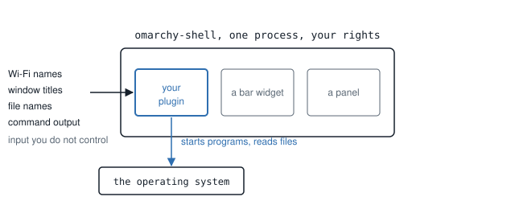
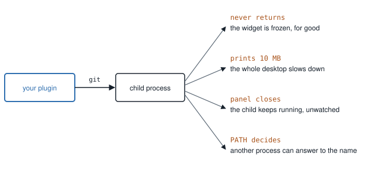
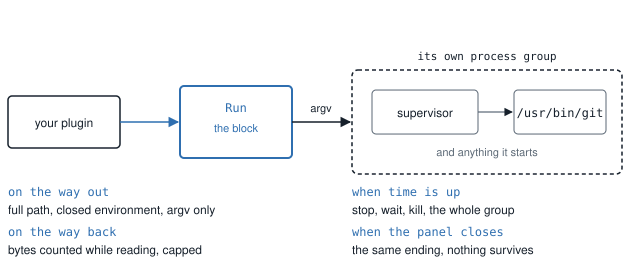
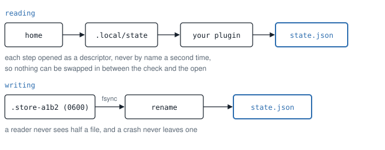

# Why the blocks exist

The commands are documented elsewhere. This page is the argument behind the
two blocks a plugin copies into its own tree: why that plumbing is worth
taking from somewhere else, and why the review spends most of its words on
it instead of on what a plugin does.

## A plugin runs inside the desktop, not beside it

An Omarchy plugin is loaded into the shell. One long-lived process hosts
every widget on the screen and runs with the person's own rights, and the
values a plugin displays come from places it does not control: network and
device names, window titles, filenames, the output of whatever it starts.

<picture>
  <source media="(prefers-color-scheme: dark)" srcset="media/why-shell-dark.svg">
  
</picture>

*The plugin sits inside the shared process. What it reads comes from
outside; what it starts runs as the person.*

Two things follow, and they are the whole reason for this page.

A bug is not contained to the plugin that has it. A command that never
returns does not freeze one widget's author; it freezes the bar for
everyone, until the session is restarted. A command that prints without
bound does not fill the plugin's memory; it fills the shell's.

And a shortcut is not a private shortcut. Whatever a plugin starts inherits
the rights the person has, on input the plugin did not write. The glue
around a feature is where an ordinary convenience becomes somebody else's
problem.

## The four ordinary failures

Starting a program looks like one line. Unguarded, that line has four
familiar endings.

- It never returns, and the widget stays where it is.
- It prints ten megabytes of something, and the whole desktop feels it.
- The panel closes and it keeps running, with nothing watching it.
- `PATH` decided which program it was, so another process could answer to
  the name today.

<picture>
  <source media="(prefers-color-scheme: dark)" srcset="media/why-failures-dark.svg">
  
</picture>

*One unguarded child, four ordinary endings. Three are the user's problem;
the fourth is everyone's.*

None of these appears on the author's own machine. The hardware is fast,
the `PATH` is clean, the input is friendly and the session is restarted at
the end of the day. The people who install the plugin have none of that.

Reading and writing a file of the plugin's own looks even simpler, and has
the same shape of problem: between the moment a path is checked and the
moment it is opened, something else can change what is there, and a write
interrupted halfway leaves a reader with half a file.

## What Run does about it

The Run block sits between the plugin and the program it starts, and does
the same four things every time, in the order a run happens.

<picture>
  <source media="(prefers-color-scheme: dark)" srcset="media/why-run-dark.svg">
  
</picture>

*The block does not change what a plugin runs. It fixes how it starts, how
it is read, and how it ends.*

On the way out, the program is named by an absolute path and started with a
closed environment and an argv list, so nothing outside decides which
program runs or what it inherits.

On the way back, the bytes are counted while they are read, against a cap
the plugin sets. Output that goes over the cap ends the run instead of
arriving.

At the deadline, the run is stopped: terminate, a short grace, then kill,
to the whole process group, and the leader is reaped last, so a child that
outlives its parent is ended too.

When the component is destroyed, because the panel closed or the plugin
reloaded, the same ending runs.

## What Store does about it

The Store block reads and writes a plugin's own state as one transaction.
Every directory from the home downward is opened as a descriptor that
cannot follow a link, and a name is never resolved a second time, so
nothing can be swapped in between the check and the open. What is read is
capped and parsed against a schema. What is written goes to an exclusive
file beside the target, is flushed, and is renamed into place, so a reader
never sees half a file and a crash never leaves one.

<picture>
  <source media="(prefers-color-scheme: dark)" srcset="media/why-store-dark.svg">
  
</picture>

*The same transaction every time: walk by descriptor, cap what is read,
write beside the file and rename it into place.*

## Why these two and not ten

Because this is where the review's time goes. Over one measured week of the
marketplace, one maintainer wrote 1,530 comments, of which 1,001 block a
submission. Each blocking comment was classified against the lines the two
blocks own
([M13](MEASUREMENTS.md#m13-what-the-review-blocks-on-over-one-week-of-comments-and-which-of-it-a-block-can-own)):
587 raise a line Run owns, 527 a line Store owns, and together they are
raised by 777 of the 1,001.

The largest single lines are the ones above.

| Block | The line | Blocking comments that raise it |
| ----- | -------- | ------------------------------: |
| Run | an absolute executable path | 366 |
| Run | a closed environment | 351 |
| Run | an output cap enforced while reading | 313 |
| Run | a real deadline | 291 |
| Store | descriptor-relative opens that cannot follow a link | 392 |
| Store | no check-then-use | 288 |
| Store | an atomic replace | 273 |

Read every one of those as an upper bound. A comment that raises a line is
not a comment a block resolves: the block owns the plumbing, the review
owns the decision, and a submission can be blocked for reasons no block can
own. It is one reviewer and one week.

## What this is not

It is not approval. No reviewer has seen a plugin built this way yet, and a
block never claims that a plugin passes review or that it is safe.

It is not a sandbox. The plugin still runs with the person's rights, and
what it does with them is the author's to answer for.

It is not the marketplace's rules. The lines come from counting public
review comments, and they are cited as counts, never as policy.

And the copy in the tree belongs to the plugin. Edit it and it is the
author's code: `omakit add` refuses to overwrite it, and `inspect` reports
it as modified rather than as a block it knows.

The contracts themselves, line by line with the count each answers, are in
[BLOCKS.md](BLOCKS.md).
